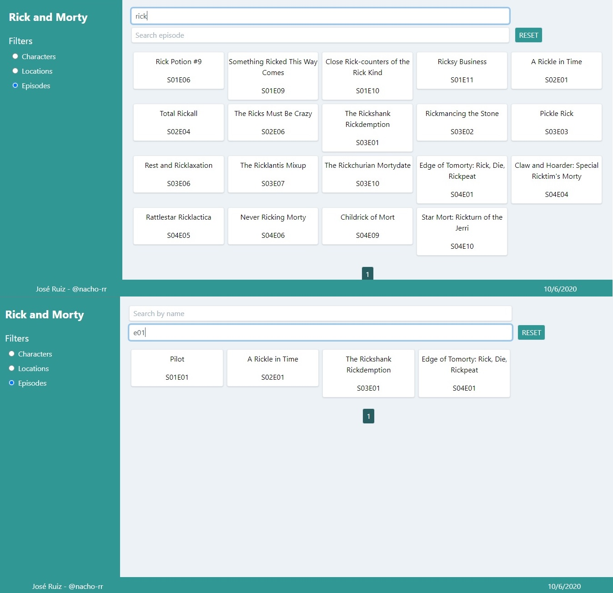

This project was bootstrapped with [Create React App](https://github.com/facebook/create-react-app).

## Available Scripts

In the project directory, you can run:

### `npm start`

Runs the app in a server deployment mode.

### `npm run dev`

Runs the app in the development mode. 

Open [http://localhost:3000](http://localhost:3000) to view it in the browser.

The page will reload if you make edits. 
You will also see any lint errors in the console.

### `npm run build`

Builds the app for production to the `build` folder. 
It correctly bundles React in production mode and optimizes the build for the best performance.

The build is minified and the filenames include the hashes. 
Your app is ready to be deployed!

## Learn More

You can visit the web app [here](https://rickandmorty-webapp.herokuapp.com/).

#### About this app

You can search Characters, Locations or Episodes of Rick and Morty's series.

To search by Characters, you must first choose the characters filter and after typing three or more characters starting to search by name or type or even both.

With the results you can click on any one to open a modal to show you more details about this character.

To search by Locations, you must first choose the locations filter and after typing three o more characters starting to search by name or type or even both.

With the results, you can click on any one to open a modal that shows you more details about this location and its first five characters at this location.

To search by Episodes, you must first choose the episodes filter and after typing three o more characters starting to search by name or episode or even both.

With the results, you can click on any one to open a modal that shows you more details about this episode and its first five characters at this episode.

To reset the search you can click on button reset and this clear all results.

